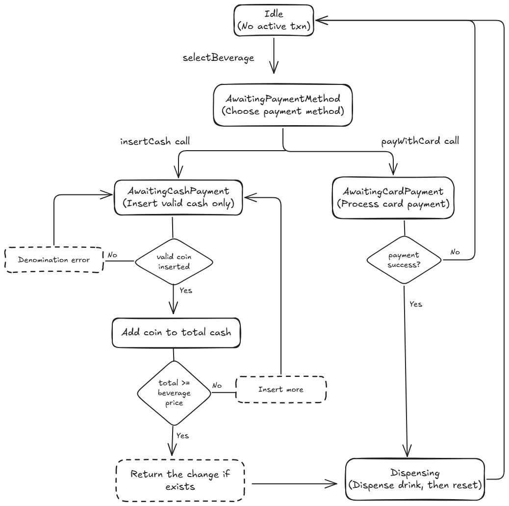

# Vending Machine

Assignment solution for ProtoPie Software Engineer (Backend) position.

# Architecture and Design Overview

## Overview

The vending machine project implements a state-driven transaction mechanism for beverage dispensing.
It supports multiple payment methods (cash and card), cancellation, and error handling (e.g., invalid coin insertions),
all managed through a well-defined state pattern.

## Architecture

### Core Components

- **VendingMachine:**  
  This is the central class that holds the current state, selected beverage, inserted cash, and references to the beverage inventory. It delegates user actions (beverage selection, cash insertion, card payment, dispensing, and cancellation) to the current state.

- **BeverageInventory:**  
  Maintains the list of beverages available for selection and handles lookups, which verifies the availability of a beverage.

- **CardPayment:**  
  Encapsulates card payment functionality, ensuring that the card balance is sufficient to cover the transaction cost.

- **Beverage:**  
  Represents an individual beverage, including its price and stock quantity. It provides methods to update stock and decrement the quantity upon dispensing.

### State Pattern

The project leverages the **State Pattern** to manage complex transaction flows cleanly and modularly. A sealed interface, `VendingMachineState`, defines the contract for different machine states. Each concrete state class implements behaviors specific to its transactional phase.

#### Key States

- **Idle:**  
  The starting state. The machine is ready to start a new transaction.  
  **Behavior:** Accepts beverage selection; rejects cash/card actions.

- **AwaitingPaymentMethod:**  
  Triggered after a beverage is selected.  
  **Behavior:** Prompts the user to choose between cash and card payment. Transitions to either `AwaitingCashPayment` or `AwaitingCardPayment`.

- **AwaitingCashPayment:**  
  Handles cash insertion.  
  **Behavior:** Accepts valid coins, aggregates cash, calculates change, or logs invalid denominations. Remains in this state until sufficient cash is inserted.

- **AwaitingCardPayment:**  
  Manages card transactions.  
  **Behavior:** Processes card payments, handling both success and card payment failure scenarios.

- **Dispensing:**  
  Executes the dispensing of the selected beverage.  
  **Behavior:** Decrements beverage stock, dispenses the product, and automatically resets the machine to Idle.

- **Cancelled:**  
  Manages transaction cancellations.  
  **Behavior:** Refunds any inserted cash (if applicable) and resets the machine to Idle.

## Design Rationale

### Why Use the State Pattern?

- **Encapsulation:**  
  Each state encapsulates only those behaviors and operations valid for its specific phase in the transaction process. This keeps concerns separated and the code highly modular.

- **Flexibility & Maintainability:**  
  The design makes it straightforward to add or modify states (e.g., introducing additional payment methods or refining cancellation logic) without impacting other components of the system.

- **Simplified Workflow Management:**  
  The `VendingMachine` class delegates actions to the current state. This allows transparent state transitions (e.g., from beverage selection to payment to dispensing) and uniform error handling (e.g., invalid coin insertions are managed within `AwaitingCashPayment`).

### Handling Edge Cases

- **Invalid Coin Insertion:**  
  If an invalid coin is inserted in the `AwaitingCashPayment` state, the machine logs an error, returns the coin, and remains in the same state for further valid inputs.

- **Cancellation:**  
  Cancellation is allowed only in certain states (e.g., `AwaitingPaymentMethod`, `AwaitingCashPayment`, `AwaitingCardPayment`). In the `Idle` and `Dispensing` states, cancellation is either not meaningful or not permitted.

- **Card Payment Failure:**  
  Should a card payment fail (e.g., due to insufficient funds), the machine logs the error and resets to Idle, ensuring a clear error path.

## Code Structure and Naming

- **Code Organization:**
    - **VendingMachine.java:** Main class that manages state and delegates actions.
    - **VendingMachineState.java and its implementations:** Each state is defined in its own class (e.g., `Idle`, `AwaitingPaymentMethod`, etc.), encapsulating behavior for that phase.
    - **Other classes:** `Beverage`, `CardPayment`, and `BeverageInventory` manage domain-specific logic.

- **Naming Conventions:**
    - Class names are descriptive (e.g., `AwaitingCashPayment` clearly indicates its responsibility).
    - Variables and methods follow camelCase conventions (e.g., `insertCash`, `selectedBeverage`).

- **Design Patterns:**  
  The use of the State Pattern improves code modularity and maintains clear separation of concerns across different transaction phases.
- 
Diagram of mechanism (flow)




## Tech Stack

- Java 21

You can build, test and run the project using the Gradle Wrapper.

## Building

```bash
./gradlew build
```

## Running Tests

```bash
./gradlew test
```

## Running samples

```bash
./gradlew run
```
Above command runs sample vending machine usage scenarios from `VendingMachineClient` class